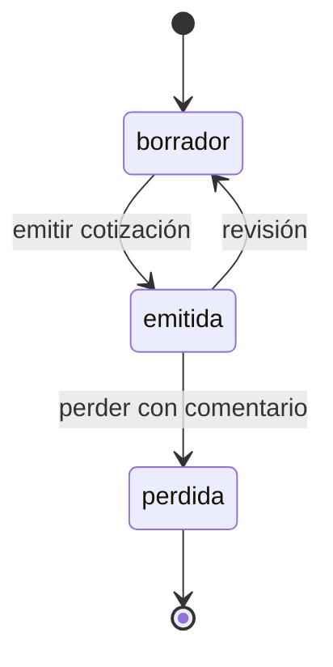
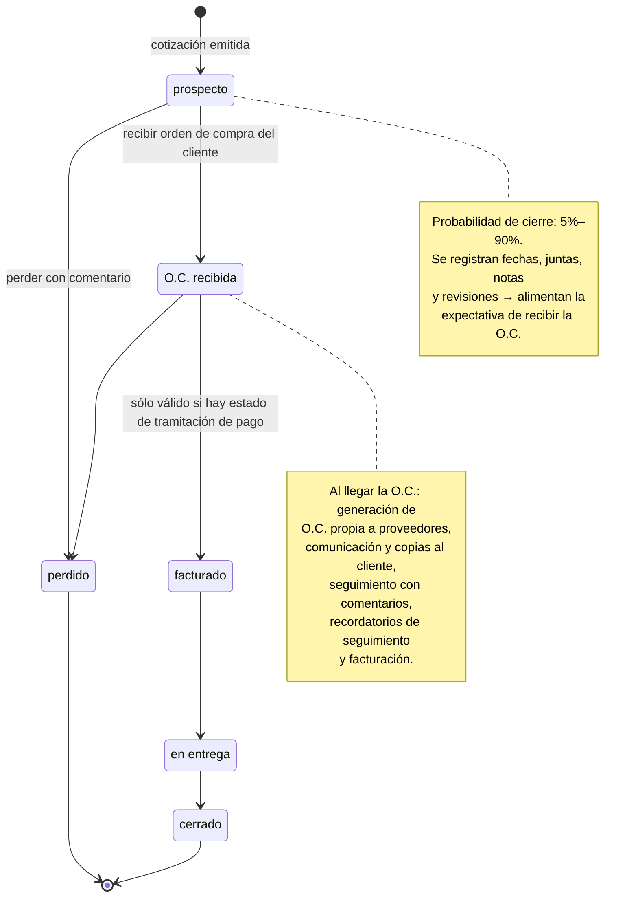
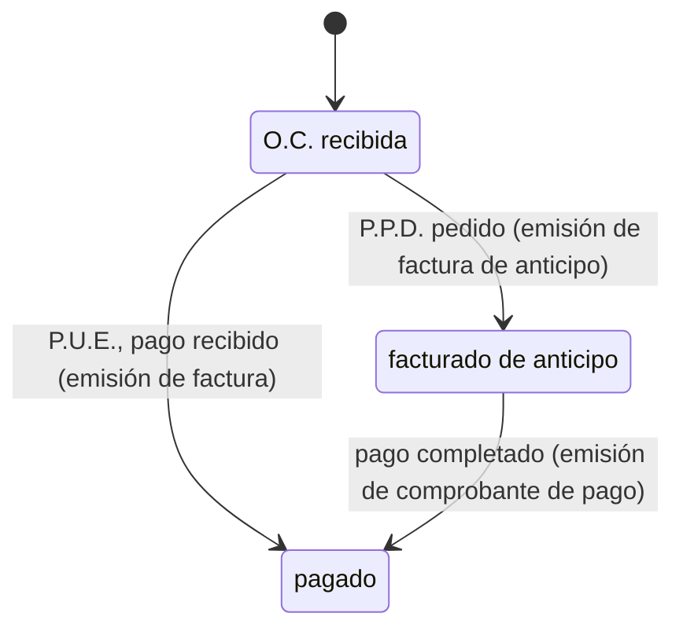

# Ciclo de vida: cotización → proyecto → cobro

Source: [`sketches/2026-10-05-cotizacion-proyecto-pago.png`](sketches/2026-10-05-cotizacion-proyecto-pago.png)
(whiteboard, 2026-10-05). Three linked state machines on one board: the quote itself,
what happens to the project after the quote is issued, and a proposed payment
sub-status. This doc transcribes each into Mermaid and flags what's already built vs.
new, since the board mixes both.

## 1. Cotización

**Shipped**, with one gap noted below. This is `quotes.status` as it exists today —
see `internal/store/pipeline.go` and `docs/guia/glosario.md`'s "Estados" section.

- `borrador --emitir cotización--> emitida` and `emitida --perder con comentario-->
  perdida` match the sketch directly.
- **Gap**: the sketch draws `emitida --revisión--> borrador` as a transition on the
  *same* quote. The shipped behavior (`Store.CreateRevision`) is different: the
  original quote moves to `revisada` (a dead end, its folio/PDF untouched) and a
  **new** quote is created in `borrador` with its own folio (`QA0012-R1`),
  `supersedes_quote_id` pointing back. `perdida` doesn't exist as a status at all
  today — there's no "mark this quote lost" action anywhere in the UI or schema.
  Whether the board's `perdida` is meant to merge with the project-level `perdido`
  below (same lost reason, same comment) is an open question — see §4.

## 2. Etapa de vida del proyecto

**Proposed.** Picks up where `emitida` leaves off. The board nests this under the
cotización box with a down-arrow, i.e. a quote becoming `emitida` is what starts a
`prospecto`.

Today's closest equivalent is `PipelineFlow` (`internal/store/pipeline.go`):
`emitida → pipeline → oc_emitida → entregada → cerrada`, driven by `Store.MoveQuote`.
The board reshapes that flow — see the mapping table after the diagram.

**Mapping against the shipped `PipelineFlow`:**

| Board state | Closest shipped status | Notes |
|---|---|---|
| `prospecto` | `emitida` + `pipeline` | Board doesn't split "sent" from "client engaged, proposal advancing" the way `pipeline` does — or it folds that distinction into the probability note (5%–90%) instead of a separate state. |
| `O.C. recibida` | `oc_emitida` | Name drift only (`oc_emitida` = "the OC went out to the manufacturer"; board's `O.C. recibida` = "the OC came in from the client"). Both describe the same moment; worth picking one name before this is built. |
| `facturado` | *(none — folded into `cerrada`)* | New. Today `cerrada` means "delivered, invoiced, and collected" in one step (`glosario.md`: "Entregada y cerrada: se entregó, se facturó, se cobró..."). The board splits invoicing out as its own state **before** delivery, which is a real behavior change, not just a rename — see §4. |
| `en entrega` | `entregada` | Name drift only. |
| `cerrado` | `cerrada` | On the board, `cerrado` follows `en entrega` directly with nothing payment-related gating it — payment is handled by the separate sub-machine in §3 instead of being baked into "cerrada" as it is today. |
| `perdido` | *(none)* | New — no lost/abandoned status exists on the project side today, same gap as `perdida` on the quote side. |

## 3. Estado de pago

**Proposed**, and the most novel piece — a real sub-status, not a rename. Branches
off `O.C. recibida` from §2; the board draws it as a separate swimlane rather than
inline in the main flow, suggesting it tracks alongside delivery rather than gating
it.

- **P.P.D.** and **P.U.E.** are taken as drawn on the board: P.U.E. goes straight to
  `pagado` on payment receipt (with the factura issued); P.P.D. issues a factura de
  anticipo first, and a comprobante de pago once the payment completes. SAT rules
  behind these terms are not specified here; they get learned during the facturación
  work (see [facturas](facturas-timbrado-y-envio.md)).
- The board draws a self-loop on `pagado` that isn't transcribed above — unclear
  whether it means partial/multiple payments reconciling against the same invoice, or
  is just a stray mark. Needs confirming against the source image before it's encoded.
- This is the same territory [`docs/PLAN.md`'s backlog](../PLAN.md#backlog--deprioritized-not-scheduled)
  already flags under **facturas** (deprioritized, not scheduled): *"facturas
  (invoices — distinct from quotes/cotizaciones; Mexican CFDI/tax documents) created
  as mutable drafts, then frozen as immutable once published... whether facturas
  reuse that [draft→frozen] machinery or need their own is worth resolving before
  either is built."* That backlog entry also ties facturas to the sales-role RBAC gap
  (the real org has sysadmin/admin/sales; today's schema only has admin/vendedor).
  This diagram is the state-machine half of that same future feature — they should
  land together, not be designed twice.

## 4. Open questions

Not resolved by the sketch alone — confirm before any of this becomes a slice.
**Update 2026-10-06:** questions 2 and 3 are settled as strict gates (no `en entrega`
without a factura, no `cerrado` without `pagado`), and the lifecycle moves to its own
`projects` table; see [the milestone plan](hitos-proyectos-y-facturas.md), which also
carries the questions still open for Emilio.

1. **Is `perdida` (quote) the same concept as `perdido` (project)?** If a quote is
   marked lost, does the project automatically become `perdido`, or can a project be
   lost for reasons unrelated to the quote (e.g. client went dark after a verbal
   OC)? The board draws them as separate nodes in separate swimlanes with no arrow
   connecting them.
2. **Does `facturado` gate `en entrega`, or can delivery happen before invoicing?**
   The board's arrow (`O.C. recibida → facturado`, annotated "sólo válido si hay
   estado de tramitación de pago") reads as a guard condition, but it's ambiguous
   whether unpaid/untracked-payment projects can still be marked delivered.
3. **Is `estado de pago` a gate on the main flow or a parallel tracker?** Drawn as a
   separate swimlane with its own `O.C. recibida` entry point rather than inline —
   suggests payment status is tracked independently of delivery status, but nothing
   on the board says whether `cerrado` requires `pagado` first.
4. **What does the self-loop on `pagado` mean?**
5. **Naming**: `O.C. recibida` appears in both §2 and §3 referring to the same event
   — should be one state, not two, once this is modeled for real. Also reconcile
   `oc_emitida` (shipped) vs. `O.C. recibida` (board) — same moment, different name,
   pick one.
6. **Does `prospecto` need to split**, the way shipped `pipeline` currently splits
   "sent" from "client engaged"? The 5%–90% probability note suggests a confidence
   score per prospecto rather than a discrete extra state, which would be a
   different kind of model change (a field, not a transition).
