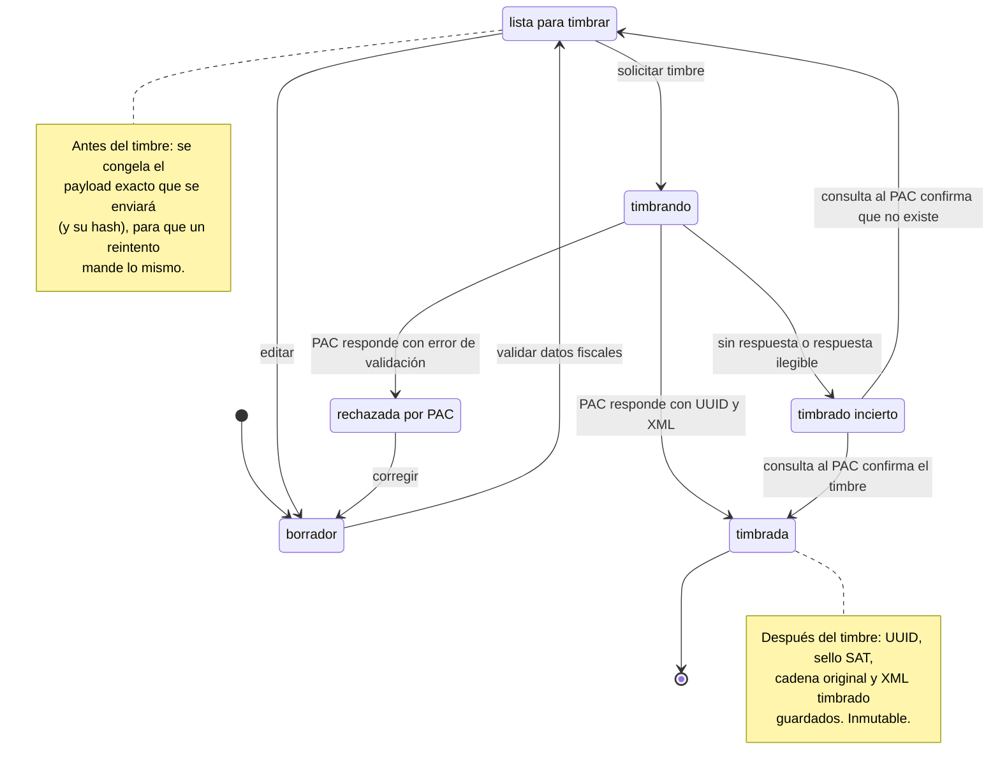
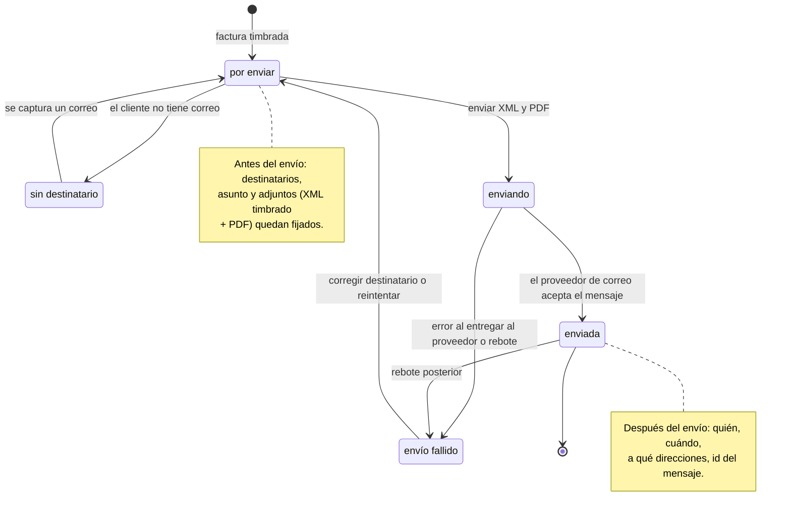
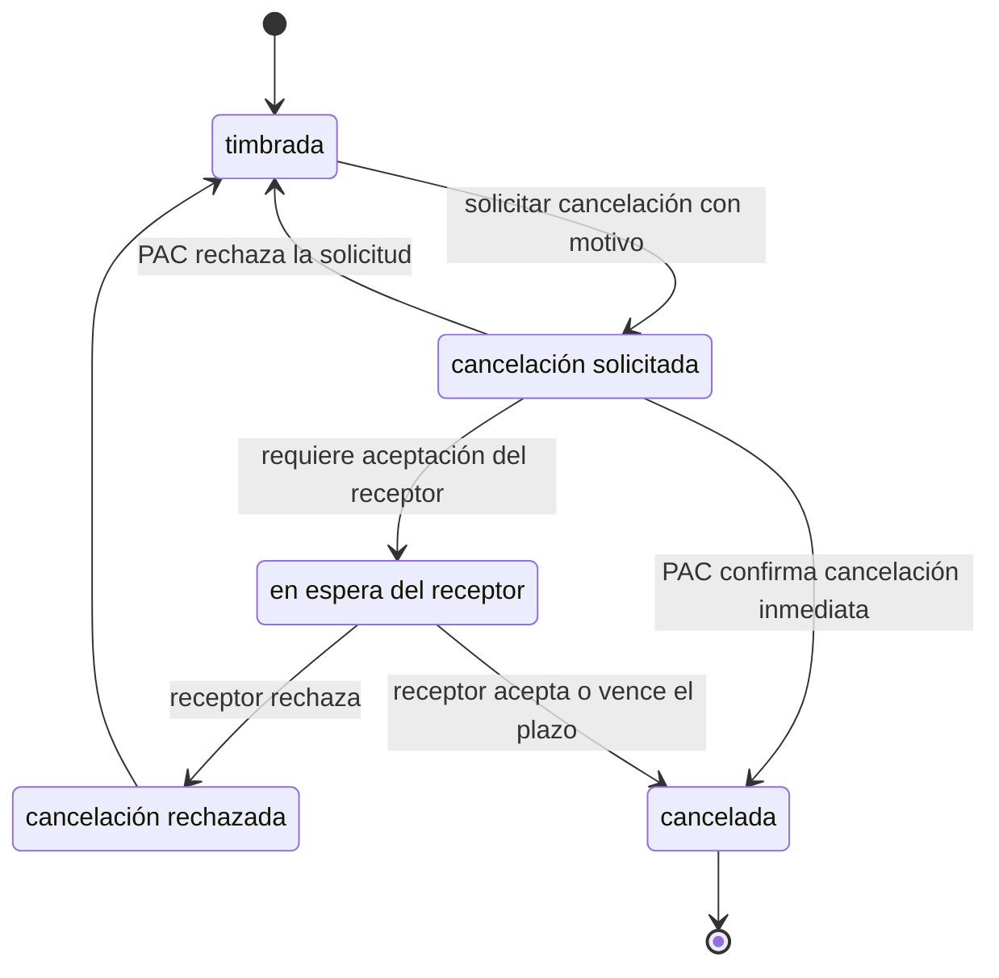

# Facturas: timbrado digital y envío

**Proposed, nothing shipped.** No factura code, tables or UI exist today. What does
exist and is reusable: `customers` already carries `rfc`, `postal_code` and `tax_regime`
(migration 0004, added "so the future invoicing/billing portal (CFDI) integration can
read them directly"), quotes already use a draft → frozen pattern (`borrador` →
`emitida`), and there is an append-only `audit_log` plus `quote_comments`. There is
**no outbound email** of any kind in the app (see §5).

This is the "facturas" item from [`docs/PLAN.md`'s backlog](../PLAN.md#backlog--deprioritized-not-scheduled),
and the invoicing half of the payment states in
[ciclo-de-vida-cotizacion-a-cobro.md](ciclo-de-vida-cotizacion-a-cobro.md). This doc is
scoped to what was asked for: tracking the moments **before and after getting the
timbre** from an external provider, and **before and after sending** the result to the
recipients. The provider is TBD, so everything below talks about a generic PAC
(Proveedor Autorizado de Certificación) and avoids any one vendor's API shape.

Facts about CFDI/SAT rules below are from general knowledge, not checked against the
current SAT annexes; items marked **(confirm)** need the contador or the chosen PAC's
docs before they become requirements.

## Why timbrado needs its own states

Stamping is a call to a third party that **has legal side effects and can fail in an
ambiguous way**. Once the PAC has stamped, the invoice exists fiscally (it has a UUID
registered with the SAT) whether or not our app heard back. So the dangerous window is
"we sent the request and don't know the outcome". The states below exist to make that
window explicit and recoverable, instead of a `500` and a user clicking "Timbrar" twice.

## 1. Ciclo fiscal: de borrador a timbrada

- **`borrador`** — mutable, same idea as a quote draft. Built from a quote / OC.
- **`lista para timbrar`** — local validation passed: receptor fiscal data complete
  (RFC, name as registered with the SAT, `postal_code`, `tax_regime`, uso de CFDI),
  emisor certificate (CSD) valid, totals consistent with the frozen quote. The payload
  is frozen here. This is the **"before timbrado"** checkpoint.
- **`timbrando`** — a request is in flight. Persist the attempt row *before* the call
  (see §6), not after, so a crash mid-call leaves evidence.
- **`timbrado incierto`** — timeout, dropped connection, unparseable response. The
  rule: **never retry the stamp blindly from here.** First ask the PAC whether a stamp
  exists for that payload/identifier, then resolve to `timbrada` or back to
  `lista para timbrar`. Whether the chosen PAC offers a lookup by our own reference
  (or rejects duplicates) is a **selection criterion** for the TBD provider.
- **`rechazada por PAC`** — definitive validation error (bad RFC/régimen/CP
  combination, expired CSD, catalog mismatch). Keep the PAC's error text; user fixes
  and returns to `borrador`. No fiscal document exists.
- **`timbrada`** — the **"after timbrado"** state. Fiscally real and immutable. Any
  correction is a cancellation + replacement (§3), never an edit.

## 2. Envío al receptor

Starts when a factura becomes `timbrada`. Tracked as its own status, **separate from the
fiscal status**: a factura can be `timbrada` and still unsent, or sent and later
cancelled, and conflating them into one enum multiplies states.

- The CFDI is delivered to the receptor as the **XML plus a PDF representation**
  **(confirm that both are required by the SAT rules for this use)**.
- "`enviada`" means the mail provider accepted the message, not that the client read it.
  Open/read tracking is out of scope unless asked for. A later bounce flips it to
  `envío fallido`, which is why that edge exists.
- Resends are normal (client lost the email): a resend is a new send event on an
  already-`enviada` factura, not a state change, so the history lists every send.

## 3. Cancelación

Only reachable from `timbrada`. Cancelling is also a call to the PAC/SAT and is not
instant: depending on the case the receptor may have to accept or reject it.
**(confirm exact rules and amounts with the contador)**

- A cancellation request carries a **motivo** (the SAT defines four codes; one of them
  requires pointing at the UUID of a replacement factura). That ties "corregir una
  factura timbrada" to: create replacement draft → stamp it → cancel the original with
  its UUID. The UI should drive that sequence rather than expose raw cancellation.
- `cancelación rechazada` returns to `timbrada`: the invoice is still valid and the
  rejection stays in the history.
- Sending a cancellation notice to the receptor is a send event like §2 and should be
  tracked the same way.

## 4. Relación con el estado de pago

The payment board ([§3 of the other doc](ciclo-de-vida-cotizacion-a-cobro.md#3-estado-de-pago))
hangs off the factura:

| Method | Factura | Later |
|---|---|---|
| **P.U.E.** | factura `timbrada` + `enviada` | pago recibido → `pagado` |
| **P.P.D.** | factura `timbrada` + `enviada` | each payment needs a **complemento de pago** (itself a CFDI: its own timbrado + envío), then `pagado` |

Consequence: the §1–§2 machines must be reusable for a **second document type**
(complemento de pago), not hard-wired to "factura de venta". Modeling a generic
"comprobante" with a `tipo` (ingreso, pago, later egreso/nota de crédito) costs little
now and avoids a rewrite. **(confirm)** the deadline for issuing the complemento after a
payment, since that is what the "recordatorios de seguimiento y facturación" note on the
whiteboard would be driven by.

Terminology to settle: the whiteboard's P.P.D. branch says *"factura de anticipo"*.
In SAT usage an anticipo is its own thing (an advance payment CFDI later related to the
final invoice), distinct from a PPD invoice (deferred payment, settled via complementos).
They may be the same thing in Cladex's actual process or not; this affects the model.

## 5. Dependencies this exposes

- **Email**: the app has no outbound mail (`PLAN.md`: "no email dependency" was a
  deliberate auth decision). Sending facturas needs a provider (SMTP relay or
  transactional API), credentials in the NAS config, and a decision on the sender
  domain (`cladex.com.mx` SPF/DKIM). The 8 GB shared box argues for an external
  provider, not a local MTA.
- **PAC credentials and the CSD** (the emisor's certificate and private key) are
  secrets. The distroless/NAS setup needs a plan for storing them; the CSD key must not
  land in the DB or the repo in the clear.
- **Customer data gaps for CFDI 4.0**: `customers` has `rfc`, `postal_code`,
  `tax_regime` but not the **name exactly as registered with the SAT** (`name` is a
  free-form trade name today), nor a default **uso de CFDI**. Both are likely needed.
- **Emisor settings**: Cladex's own RFC, régimen, lugar de expedición, factura
  series/folio sequence (parallel to `folio_sequences` for quotes), CSD.
- **Network**: PAC calls are outbound from the NAS, which is fine behind NAT, but
  timeouts and retries need to run off the request path (a background worker or a
  polling job), unlike everything else in the app today.

## 6. Tracking model (sketch)

The "before and after" requirement maps to an **append-only event log per
comprobante**, in the same spirit as `audit_log` and `quote_comments`, plus the current
status on the row for cheap listing:

| Event | Recorded when | Payload |
|---|---|---|
| `validated` | → `lista para timbrar` | frozen payload hash |
| `stamp_requested` | **before** the PAC call | attempt id, payload hash, provider |
| `stamp_succeeded` / `stamp_rejected` / `stamp_unknown` | **after** the call | UUID + raw response / error / timeout details |
| `stamp_reconciled` | resolving `incierto` | PAC lookup result |
| `send_prepared` | → `por enviar` | recipients, attachments |
| `send_attempted` / `send_accepted` / `send_failed` / `bounced` | around the mail call | provider message id / error |
| `cancel_requested` / `cancel_resolved` | around the cancel call | motivo, replacement UUID, outcome |

Raw PAC request/response bodies are kept (they are the evidence in a dispute), minus
anything secret. Like `quote_lines`, a `timbrada` factura's content is never rewritten.

## 7. Open questions

1. **Which PAC?** Drives the API shape, sandbox availability, pricing per stamp, whether
   it supports lookup-before-retry, and cancellation handling. Compare 2–3 on exactly
   the criteria in §1 and §3 before choosing.
2. **Does a factura always come from a quote/OC**, or can one be created standalone
   (anticipos, services, one-off sales)? Determines whether `facturado` in the project
   lifecycle is derived from a factura or is its own manual state.
3. **One factura per OC, or several** (partial deliveries, advance + final)? Affects the
   relation between `en entrega`, `facturado` and `pagado`.
4. **Anticipo vs. PPD** — see §4.
5. **Who may stamp and cancel?** Ties into the sysadmin/admin/sales RBAC gap in the
   backlog; stamping is irreversible enough that it probably wants a narrower role than
   drafting.
6. **Send automatically on timbrado, or require a manual "Enviar"?** The whiteboard's
   "emisión de copias" note suggests copies to several people.
7. **Do we need delivery confirmation beyond "provider accepted"?**
8. **Retention**: how long XML/PDF must be kept and where they live (the NAS backup
   story covers files under the data dir) **(confirm)**.
9. **Test vs. real environment**: the PAC sandbox stamps are not valid. Prod
   currently holds mock quotes; the same separation must hold for facturas so a test
   stamp can never be confused with a real one.
