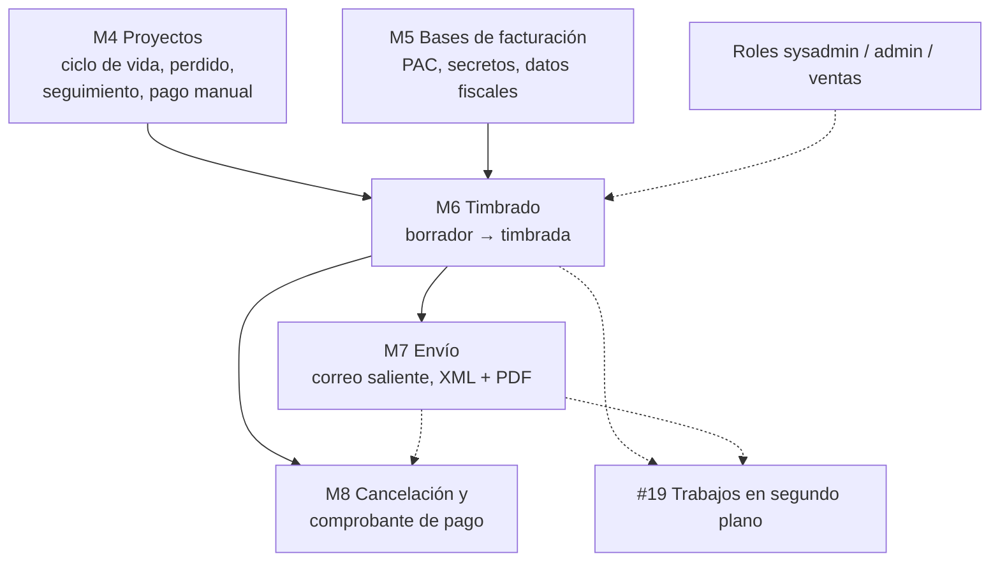

# Hitos: proyectos y facturas

**Proposed, nothing shipped.** The implementation order for the two design docs in this
directory: the [quote → project → payment lifecycle](ciclo-de-vida-cotizacion-a-cobro.md)
and [facturas: timbrado y envío](facturas-timbrado-y-envio.md). Milestone numbers
continue `docs/PLAN.md` (M0–M3 are shipped); a milestone moves there, slice by slice,
when it is actually started.

## Decisions this plan rests on (user, 2026-10-06)

1. **A proyecto is its own table**, not more values of `quotes.status`. It owns the
   lifecycle (`prospecto` → `cerrado`), and later the facturas and payment state.
   `quotes.status` shrinks back to `borrador` / `emitida` / `revisada`.
2. **Proyectos first.** The lifecycle has no external dependency and ships before any
   facturación code. PAC choice and the other facturación decisions are researched
   meanwhile.
3. **Strict gates.** No `en entrega` without a factura, no `cerrado` without `pagado`.
   This settles open questions 2 and 3 of the lifecycle doc.
4. **A proyecto needs a quote to exist, 1:1.** Issuing a quote opens the proyecto, and
   a revision (`QA0012-R1`) takes over the same proyecto instead of opening a second
   one, so at any time a proyecto has exactly one current quote. Confirmed as what was
   last discussed with Emilio.
5. **P.U.E. is invoiced and paid before delivery**, as the board draws it and the
   strict gates imply.
6. **Stamping is admin-only** until the roles work says otherwise.
7. **Confidence is one control, and "relevante para pronóstico" is derived from it.**
   A prospecto with probabilidad de cierre of 75% or more is relevante para pronóstico
   and is highlighted; there is no separate mark to set. This is what the team calls
   "en pipeline" in its review meeting. Design in [its own section](#probabilidad-de-cierre-y-pronóstico).

## Order and dependencies



Solid arrows are hard dependencies; dotted ones are "informs" or "nice to have first".
M4 and M5 run in parallel: M4 is code, M5 starts as research and decisions.

## M4 — Proyectos

Everything here is manual and internal: no PAC, no email. Facturas keep being issued
outside the app as today, and the proyecto records their reference by hand, so the
strict gates work from day one and M6 later replaces the typed reference with a real
comprobante.

| # | Slice | Done when |
|---|---|---|
| 4.1 | `projects` table; a proyecto opens when a quote is issued and follows its revisions. Migration moves the shipped pipeline stages off `quotes` (`emitida` → `prospecto`, `pipeline` → `prospecto` at 75% so it stays relevante para pronóstico, `oc_emitida` → `oc_recibida`, `entregada` → `en_entrega`, `cerrada` → `cerrado`) and rebuilds `quotes` with the narrower CHECK. `MoveQuote` becomes a project move; home board, filters and the quote page read the stage from the proyecto. | The home board shows the same cards as before under the new stage names; revising a quote in `oc_recibida` leaves the proyecto in `oc_recibida` with the new folio as its current quote; issued PDFs reprint byte-identically. |
| 4.2 | `perdido`: "perder con comentario" from `prospecto` and `oc_recibida`, reason required, recorded in the history. Admin can reopen. | A lost proyecto leaves the active columns, shows its reason, and is filterable. |
| 4.3 | Probabilidad de cierre y pronóstico, as designed [below](#probabilidad-de-cierre-y-pronóstico): the five-step control, fecha esperada de O.C., próximo seguimiento (a date; overdue ones are flagged, no email), the highlight at 75% and up, and the Pronóstico review view with weighted totals. | In the review meeting, the team opens one page, sees the prospectos at 75% and up sorted by expected O.C. date, and updates probability, note and next follow-up without leaving it. |
| 4.4 | Recibir O.C.: moving to `oc_recibida` captures the client's OC number, date and file, and the forma de pago (P.U.E. / P.P.D.), which is the "estado de tramitación de pago" the board requires. | A proyecto can't enter `oc_recibida` without an OC number and a forma de pago; the OC file downloads from the proyecto. |
| 4.5 | Estado de pago (manual) and the gates. P.U.E.: `oc_recibida` → `pagado` on payment, with the factura reference typed in. P.P.D.: → `facturado de anticipo` with the anticipo's reference, then → `pagado`. `facturado` requires a factura reference, `en_entrega` requires `facturado`, `cerrado` requires `pagado`. | Each blocked move explains what is missing; a P.P.D. proyecto can be delivered while unpaid but not closed. |

Notes:

- 4.1 is the only slice that rewrites production data. Production quotes are still test
  data, but it gets the usual dry run on a live-DB copy and the user's go-ahead.
- "Facturado de anticipo" for P.P.D. counts as `facturado` for the delivery gate.
  Under P.U.E. the factura is issued on payment, so a P.U.E. proyecto is paid before
  it is delivered (decision 5).
- Each slice updates `docs/guia/` in the same commit (glosario "Estados",
  cotizaciones, a new proyectos page).
- Not in M4: generating Cladex's own OC to suppliers and "comunicación y copias al
  cliente" (both on the board's `O.C. recibida` note). The first needs its own design;
  the second needs email (M7).

### Diseño de 4.1: la tabla `projects`

**Status (2026-10-06):** both commits are written, with the probability control pulled
forward from 4.3 so the old "Pasar a Pipeline" has a replacement. The as-built notes are
in [`docs/PLAN.md`](../PLAN.md#m4--proyectos). Pending: the production dry run and the
deploy.

Checked against the code as of 2026-10-06 (`internal/store/quotes.go`, `pipeline.go`,
`overview.go`, migrations 0011–0015).

**Storage.**

- `projects`: `id`, `folio` (unique), `customer_id`, `user_id` (the vendedor who owns
  it), `status`, `probability`, `probability_updated_at`, `created_at`, with audit
  triggers like every other table. Later slices add their own columns.
- `projects.folio` is the base folio of the quote that opened it (`QA0105`, what
  `baseFolio` already computes). It is the proyecto's name in the UI and its URL,
  `/proyectos/QA0105`. No new numbering.
- `projects.status` takes all six values from the start (`prospecto`, `oc_recibida`,
  `facturado`, `en_entrega`, `cerrado`, `perdido`), since SQLite can't widen a CHECK
  without rebuilding the table. 4.1 only uses the four that exist today.
- `quotes.project_id`: NULL on a first draft, set when it is issued (`IssueQuote`
  creates the proyecto in the same transaction), and copied onto the draft by
  `CreateRevision`.
- **No `current_quote_id` column.** The current quote is the one quote of the proyecto
  that is not `revisada`: the `emitida` one, or the `borrador` revision being worked
  on. Deriving it means it can't point at the wrong row, and while a revision is in
  draft the proyecto shows that draft's amount marked "en revisión".
- `quotes.status` goes back to `borrador` / `emitida` / `revisada`. Rebuilding
  `quotes` for the narrower CHECK follows migrations 0012 and 0013.

**Migration.** One proyecto per revision chain that has an issued quote; drafts that
were never issued get none.

| Chain's live quote is | Proyecto | Quote becomes |
|---|---|---|
| `emitida` | `prospecto`, Inicial | `emitida` |
| `pipeline` | `prospecto`, Alta | `emitida` |
| `oc_emitida` | `oc_recibida` | `emitida` |
| `entregada` | `en_entrega` | `emitida` |
| `cerrada` | `cerrado` | `emitida` |
| `borrador` revision of a `revisada` quote | `prospecto`, Inicial | unchanged |

**Behavior that changes.**

- Today only an `emitida` quote can be revised, so a quote that has moved to
  `pipeline` or beyond can't be. Once the stage lives on the proyecto every live quote
  is `emitida`, so the rule is restated: **revisions are allowed while the
  proyecto is a `prospecto`**, which newly allows revising what is today `pipeline`,
  and locked from `oc_recibida` on (user, 2026-10-06), so the O.C. and later the
  factura always refer to one fixed quote.
- `MoveQuote` becomes a move of the proyecto, with the same one-step and
  admin-only-backwards rules. `facturado` is skipped until 4.5 gives it meaning, so
  `oc_recibida` → `en_entrega` keeps working as `oc_emitida` → `entregada` does now.
- **History**: `quote_comments` stays as it is. The proyecto's history is the comments
  of all its quotes in one timeline, and stage moves keep being written as comments
  on the current quote. No new events table until something needs one.
- The home board groups by proyecto stage instead of quote status; `revisada` stops
  being a column, since a superseded quote is not a proyecto.

**Two commits, so the data change is reviewed apart from the UI change.**

1. Schema, migration and store. Screens look the same but read the stage from the
   proyecto, under the new stage names. This is the one with the production dry run.
2. The proyecto page (`/proyectos/{folio}`: stage, history, its quotes) and a
   Proyectos list. The quote page links to its proyecto and loses the stage buttons;
   the stage filters move from Cotizaciones to Proyectos.

### Probabilidad de cierre y pronóstico

The use case, from Emilio: everyone meets to go over the proyectos that are close to
closing, which they call "en pipeline". Industry CRMs (Salesforce, SAP, Oracle,
Dynamics; recalled, not re-checked) converge on the same three things: a probability
that is in practice a few preset steps, an expected close date, and a marker for what
counts in the forecast. SAP's name for the marker, "relevant for forecast", is the one
adopted here.

- **Probabilidad de cierre** exists only while a proyecto is a `prospecto`. It takes
  one of five fixed steps, each shown as one word, with the percentage as a reference
  beside it and as the weight in totals:

  | Step | Word | Relevante para pronóstico |
  |---|---|---|
  | 10% | Inicial | |
  | 25% | Baja | |
  | 50% | Media | |
  | 75% | Alta | yes |
  | 90% | Inminente | yes |

  Never 0 or 100: receiving the O.C. or losing the proyecto is what ends the guess. A
  new proyecto starts at Inicial. The value lives on the `projects` row from 4.1 on,
  so the migration keeps the shipped `emitida` / `pipeline` distinction (`pipeline`
  becomes Alta).
- **Relevante para pronóstico** is derived: Alta or Inminente (≥ 75%). It is never
  stored or set by hand, so it can't disagree with the probability. The threshold is
  a constant next to the steps.
- **Control**: a row of five radio-style buttons labelled with the words, not a slider
  and not a typed number. It works with keyboard and screen reader, and nobody has to
  defend 35% against 40%. Changing it saves in place and writes "Probabilidad: Baja →
  Alta" to the proyecto's history, with an optional note.
- **Highlight**: relevante para pronóstico proyectos are marked wherever prospectos
  are listed (home board, lists, the proyecto page), with a text label and not colour
  alone.
- **Pronóstico view**: the meeting page. Relevante para pronóstico proyectos sorted by
  fecha esperada de O.C., each editable in place. A toggle shows the remaining
  prospectos so one can be promoted during the meeting. Each proyecto shows:
  - folio, client, vendedor and amount;
  - the probability control;
  - its dates: quote issued, vigencia, fecha esperada de O.C.;
  - the next relevant event, whichever comes first of próximo seguimiento, the
    vigencia running out and the fecha esperada de O.C., flagged when overdue;
  - the latest update from the history (who, when, text);
  - the contact (`customers.contact_name`, phone, email; one per client today);
  - when the probability was last changed, so stale guesses are visible.

  The total and the weighted total (amount × percentage) close the page.

```
QA0012-R1  Constructora X · Laura M.          $482,000        ( Inicial | Baja | Media |[Alta]| Inminente )  75%
  Emitida 22 sep · vigencia 22 oct · O.C. esperada 15 oct     Probabilidad actualizada hace 3 días
  Próximo: seguimiento 9 oct                                   Contacto: Ing. Pérez · 55 1234 5678
  Última nota (Laura, 3 oct): "Compras pidió ajustar entrega"
```

## M5 — Bases de facturación

Starts as decisions, in parallel with M4. No user-visible feature except 5.2.

| # | Slice | Done when |
|---|---|---|
| 5.1 | Choose the PAC ([#20](https://github.com/gerrygoo/cladex-web/issues/20)): compare 2–3 on sandbox, price per stamp, lookup by our own reference, cancellation. Decide where PAC credentials and the CSD live on the NAS, and how a sandbox stamp can never pass for a real one. | The choice and the secrets plan are written into the facturas doc and #20; a sandbox account exists. |
| 5.2 | Customer fiscal fields ([#17](https://github.com/gerrygoo/cladex-web/issues/17)): razón social as registered with the SAT, default uso de CFDI, plus whatever 5.1's PAC requires. Optional on the form. | Fields are editable, audited and documented in the guide. |
| 5.3 | Emisor settings (RFC, régimen, lugar de expedición), factura series and folio sequence, CSD and PAC credentials loaded from config, never the DB. | The app starts with and without facturación configured, and says which it is on `/ajustes`. |

## M6 — Timbrado

The first milestone of #20. Manual actions only, no job system. Admin-only (decision 6).

| # | Slice | Done when |
|---|---|---|
| 6.1 | `comprobantes` (with a `tipo`, so the comprobante de pago reuses it) and its append-only event log. A factura `borrador` is built from the proyecto's current quote once it is `oc_recibida`; editable; "validar" freezes the payload and its hash as `lista para timbrar`. | A draft with incomplete receptor data can't be validated and says why; editing a `lista` factura returns it to `borrador`. |
| 6.2 | PAC client against the sandbox: `timbrando` → `timbrada` / `rechazada por PAC`. Attempt row written before the call. Stamped XML and a PDF stored under the data dir; `timbrada` is immutable. | A sandbox factura is stamped end to end and downloads as XML and PDF; a rejected one shows the PAC's error and returns to `borrador`. |
| 6.3 | `timbrado incierto`: timeouts and unreadable responses land here; "consultar al PAC" resolves to `timbrada` or back to `lista`. No blind retry. | A simulated timeout can't produce two stamps. |
| 6.4 | The proyecto's gates read real comprobantes: `facturado` means a `timbrada` factura exists, replacing 4.5's typed reference (kept for proyectos invoiced before M6). First real stamp in production. | A proyecto reaches `facturado` only through a stamp; one real factura is stamped and checked by the contador. |

## M7 — Envío

| # | Slice | Done when |
|---|---|---|
| 7.1 | Outbound email ([#18](https://github.com/gerrygoo/cladex-web/issues/18)): provider, sender domain (SPF/DKIM), a send API with a recorded outcome per send. | A test message from production arrives and its outcome is recorded. |
| 7.2 | Send a `timbrada` factura (XML + PDF): `por enviar` → `enviada` / `envío fallido` / `sin destinatario`, manual retry, resends listed in the history. | A factura is sent to several recipients; a bad address shows as failed and can be fixed and resent. |

## M8 — Cancelación y comprobante de pago

| # | Slice | Done when |
|---|---|---|
| 8.1 | Cancellation with motivo, including the wait on the receptor, driven as "replace this factura" where a correction is meant. | A sandbox factura is replaced and the original ends `cancelada`, with the full exchange in its event log. |
| 8.2 | Comprobante de pago for P.P.D.: a second `tipo` through the same stamp-and-send machinery; stamping it is what moves the proyecto to `pagado`. | A P.P.D. proyecto goes anticipo → pago completado → `cerrado` without a typed reference anywhere. |

## Later, not scheduled

- **Background jobs** ([#19](https://github.com/gerrygoo/cladex-web/issues/19)), once
  M6–M7 have shown what retries and timeouts really need.
- **Roles** (sysadmin / admin / ventas) and who may stamp and cancel. M6 ships
  admin-only as a stopgap.
- **Órdenes de compra a proveedores**: a separate product goal, tracked in
  [its own doc](ordenes-de-compra-a-proveedores.md) and
  [#21](https://github.com/gerrygoo/cladex-web/issues/21).
- Follow-up reminders by email, copies to the client.

## Questions for Emilio

None of these block M4 from starting. The first affects 4.2's final shape.

1. **Is losing a quote the same as losing the proyecto?** The board draws `perdida`
   and `perdido` as separate nodes. This plan builds only the proyecto one.
2. **One factura per O.C. or several** (partial deliveries)? M6 assumes one, plus the
   anticipo/pago pair for P.P.D.
3. **The self-loop on `pagado`** on the board: partial payments, or a stray mark?
4. **Several contacts per client?** The Pronóstico view shows the client's single
   contact. If a proyecto's contact differs from the client's, that is a new field.
5. **Send on timbrado or on a manual "Enviar"**, and to whom ("emisión de copias")?
